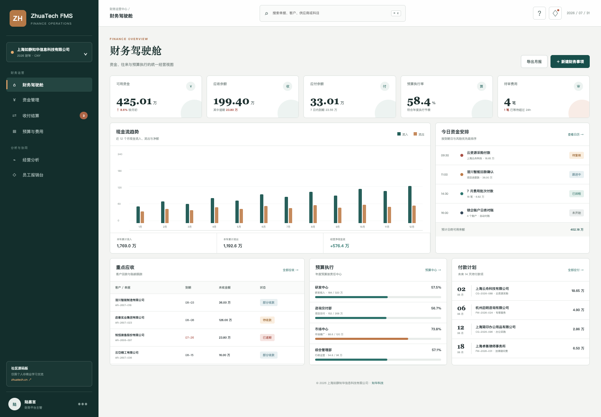
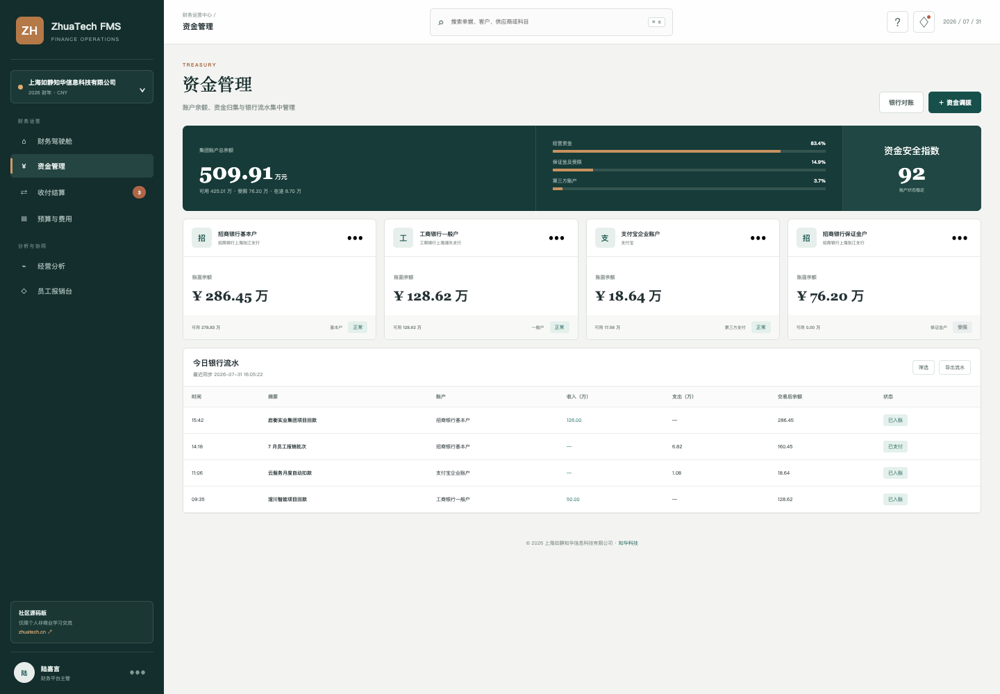
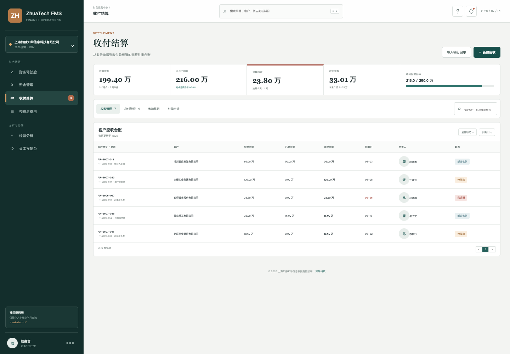
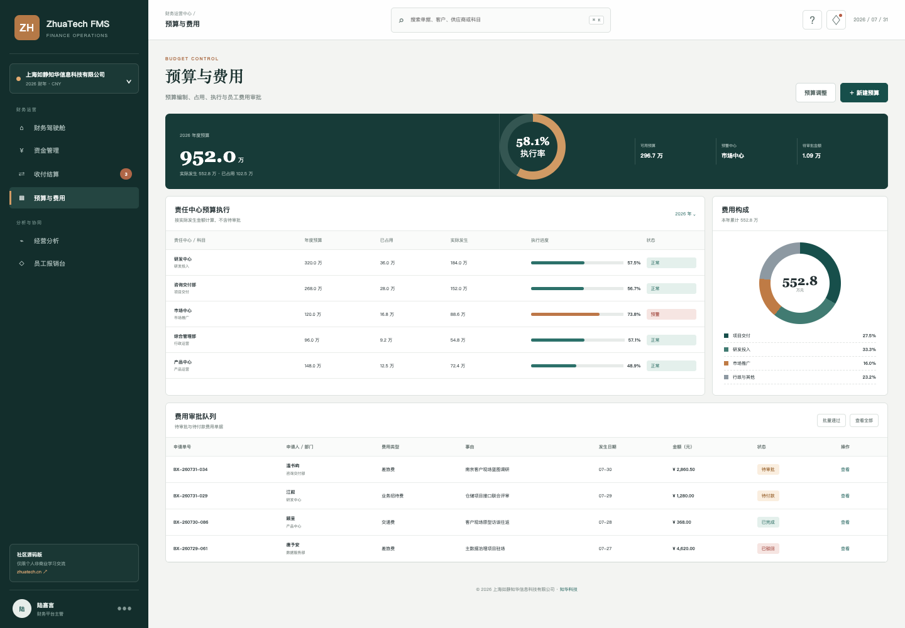
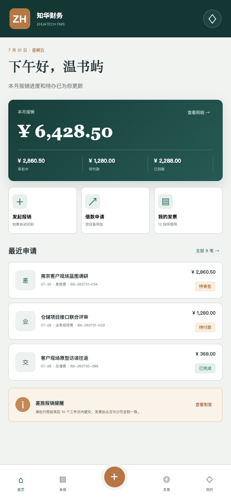

<div align="center">

# ZhuaTech FMS

### 知华科技财务管理系统 · 社区源码版

资金管理　/　应收应付　/　预算控制　/　费用报销　/　经营分析

[官方网站](https://www.zhuatech.cn/) · [快速启动](#运行这套工程) · [功能边界](#社区版交付范围) · [商业授权](#许可与使用边界)

</div>

---

> 由 **知华科技（上海如静知华信息科技有限公司）** 设计与维护。项目提供可运行的 Java + Vue + MySQL 前后端工程，用于展示企业资金、往来、预算和员工费用的协同链路。

## 一套财务系统，先回答五个经营问题

公司的钱分布在哪些账户？哪些客户款项临近到期？未来两周要支付多少？各责任中心预算消耗是否合理？员工报销卡在哪个环节？ZhuaTech FMS 把这些信息组织为财务管理端和员工移动端两个工作空间，让数据从业务单据进入经营视图，而不是继续散落在表格和聊天记录中。

这是一套适合财务管理系统、资金平台、业财一体化产品和企业应用开发学习的社区源码样板。示例中的公司、账户、客户、供应商与金额均为虚构数据。

## 产品实景

### 财务驾驶舱｜先看资金，再看经营

可用资金、应收应付、预算执行和待审费用位于同一首屏；现金流趋势、今日资金安排、重点应收和近期付款共同构成日常财务晨会视图。



### 资金中心｜账户与流水一处核对

展示基本户、一般户、保证金户和第三方支付账户，区分账面余额、可用余额及受限资金，并提供当天银行流水台账。



### 收付结算｜到期、逾期与核销清晰可追

围绕客户应收与供应商应付建立统一台账，展示来源单据、已收付、未收付、到期日、责任人和状态。



### 预算费用｜从责任中心看到每一笔申请

按责任中心呈现年度预算、占用、实际发生和执行进度，并将员工费用审批队列置于同一页面。



### 员工 H5｜拍票、报销、进度查询

移动端提供报销概览、快速发起、发票入口、最近申请和制度提醒，适配手机浏览器使用。

<p align="center"></p>

## 社区版交付范围

| 业务域 | 当前包含 | 企业落地常见扩展 |
| --- | --- | --- |
| 资金管理 | 账户台账、余额、可用资金、账户状态、流水视图 | 银企直联、资金归集、调拨审批、余额预测 |
| 应收管理 | 客户应收、来源单据、到期跟踪、回款登记、自动结清 | 开票计划、账龄分析、信用控制、催收策略 |
| 应付管理 | 供应商应付、已付与未付、付款日历 | 三单匹配、付款批次、网银指令、回单核验 |
| 预算控制 | 年度预算、责任中心、占用、实际、执行率 | 预算编制、滚动预测、调整审批、事前控制 |
| 费用报销 | 移动申请、费用分类、审批状态、付款状态 | OCR 验票、查重、电子档案、差旅标准 |
| 基础能力 | JWT、角色权限、Flyway、统一响应、异常处理 | 多法人、多账套、数据权限、SSO、审计中心 |

当前版本不替代法定会计核算软件，也未接入真实银行、支付、电子发票或税务接口。生产使用必须在取得商业授权后，结合企业内控、会计制度和监管要求完成专项设计、安全评估与验收。

## 技术账本

```text
Vue 3 + Vite 7              Spring Boot 4 + Java 21
管理端 + 响应式 H5   ─REST/JWT─>   资金 / 往来 / 预算 / 费用
                                      │
                                 MySQL 8.4
                                 Flyway 迁移
```

- 前端：Vue 3、Vue Router、Pinia、Axios，桌面财务端与员工 H5。
- 后端：Java 21、Spring Boot、Spring Security、Spring Data JPA、JWT。
- 数据：MySQL 8.4；测试环境使用 H2。
- 部署：Docker、Docker Compose、Nginx。
- Maven 坐标：`cn.zhuatech:zhuatech-fms-backend`。
- Java 根包：`cn.zhuatech.fms`。

```text
zhuatech-fms/
├── backend/          Spring Boot API、领域模型、迁移与集成测试
├── frontend/         Vue 财务管理端、员工 H5 与演示数据
├── docs/             API、架构、数据库和产品截图
├── deploy/           部署及上线安全检查
├── compose.yaml      MySQL + Java + Nginx 容器编排
└── LICENSE           社区源码许可与非商业边界
```

## 运行这套工程

### 一条命令体验

```bash
cp .env.example .env
# 先修改数据库密码、Root 密码和 JWT_SECRET
docker compose up --build
```

访问 `http://localhost:8090`，后端健康检查为 `http://localhost:8080/actuator/health`。

### 分别启动

```bash
# 创建 zhuatech_fms 数据库并配置连接信息
cd backend
mvn spring-boot:run

# 新终端启动不依赖后端的演示模式
cd frontend
npm install
npm run dev:demo
```

| 身份 | 账号 | 密码 | 可体验内容 |
| --- | --- | --- | --- |
| 系统管理员 | `admin` | `admin123` | 全部管理端能力 |
| 财务经理 | `finance` | `finance123` | 资金、收付与预算 |
| 普通员工 | `employee` | `employee123` | 费用申请与查询 |

演示账号和默认密钥只能用于本地体验，部署前必须删除或替换。

## API 导航

认证后统一访问 `/api/fms`：

- `GET /dashboard`：财务驾驶舱汇总。
- `GET /accounts`：资金账户列表。
- `GET|POST /receivables`：查询或创建应收。
- `PATCH /receivables/{id}/receipt`：登记回款。
- `GET /payables`：应付台账。
- `GET|POST /expenses`：费用查询与申请。
- `GET /budgets`：当前财年预算执行。

字段、角色和接口边界见 [docs/api.md](docs/api.md)，数据结构见 [docs/database.md](docs/database.md)。

## 许可与使用边界

**本工程仅能用于个人学习、技术研究和非商业交流，不得商用。** 未经上海如静知华信息科技有限公司事先书面授权，不得用于企业内部生产经营、商业交付、SaaS 服务、项目投标、收费培训、咨询实施、转售、托管运营或其他商业场景。

本工程采用带有非商业限制的 **ZhuaTech Community Source License 1.0**，因此不属于 OSI 定义的开源软件；请准确称为“社区源码版”。下载、复制或修改前请完整阅读 [LICENSE](LICENSE)。需要商用、私有化部署、深度开发或定制集成，请联系知华科技取得书面授权。

## 联系知华科技

**上海如静知华信息科技有限公司** 专注企业信息化、软件项目交付、FDE 与企业 AI 应用落地。

- 官网：[https://www.zhuatech.cn/](https://www.zhuatech.cn/)
- 服务方向：财务系统定制、ERP/CRM/OA 集成、银企与发票接口、私有化部署、数字化咨询
- 微信咨询：扫描下方任一二维码

<p align="center">
  
  &nbsp;&nbsp;&nbsp;
  
</p>

## 搜索关键词

知华科技 FMS、财务管理系统源码、Java 财务系统、Spring Boot FMS、Vue 财务管理系统、企业资金管理、应收应付系统、预算管理软件、费用报销系统、业财一体化、财务系统定制。

---

Copyright © 2026 上海如静知华信息科技有限公司

## 滚动预算完工预测

新增 `POST /api/fms/budget-forecast`，基于当前实际支出、已承诺金额和业务进度预测完工总成本，返回预算偏差、超支比例与风险等级。高风险结果会给出冻结非必要支出和提交预算调整方案的动作。

## 现金跑道预测

新增 `POST /api/fms/insights/cash-runway-forecast`，综合期初现金、经营流入、承诺与可变支出、应收回款率和最低储备，计算月度净消耗、现金跑道及季度末余额，输出 `POSITIVE_CASHFLOW / HEALTHY / WATCH / CRITICAL` 和催收、控费、融资动作。
